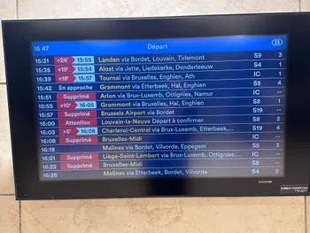

  <h1>Vertraagd</h1>
  <h2>Een analyse van treinvertragingen in Belgi&euml;</h2>

---

Treinvertragingen, afschaffingen, stakingen — we kennen het allemaal. Voor duizenden pendelaars in België vormen ze een dagelijkse bron van frustratie.
Maar hoe ernstig zijn die vertragingen eigenlijk? En valt er een patroon te ontdekken, bijvoorbeeld in het tijdstip of het type trein?

In dit project duiken we in een dataset van [Infrabel](https://opendata.infrabel.be/explore/dataset/data_punctualite_typedetrain/table/?disjunctive.rel&sort=maand).
We zoeken uit hoe vaak vertragingen voorkomen, wanneer ze zich het vaakst voordoen, en welke treintypes het kwetsbaarst zijn.
Zo proberen we grip te krijgen op een probleem waar velen dagelijks mee te maken krijgen.

